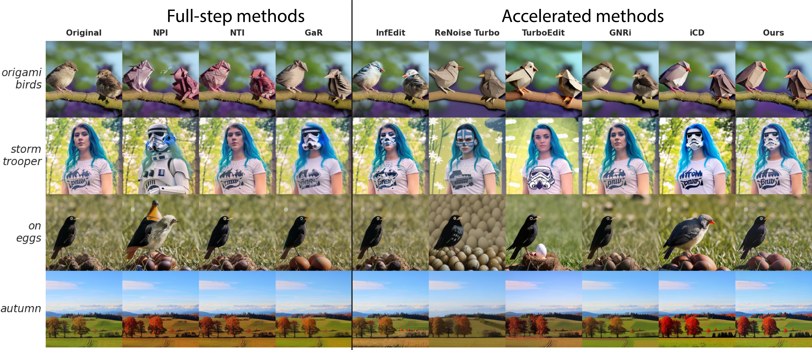
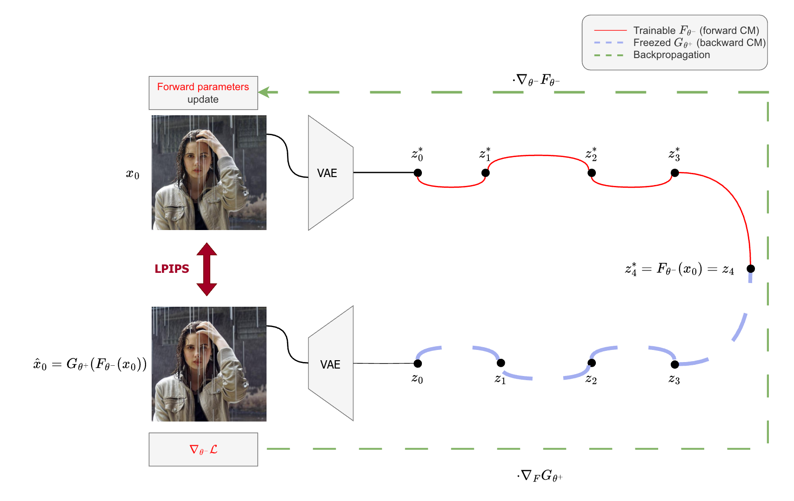
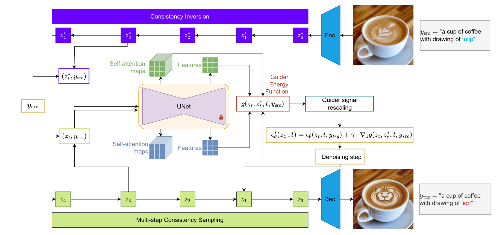

# Inverse-and-Edit
<a href="https://colab.research.google.com/drive/1GmJCTiVqbNtM-cl1Cl9jykFlwZqOiyQa?usp=sharing"></a>
[](./LICENSE)

This is the official implementation of "Inverse-and-Edit: Effective and Fast Image Editing by Cycle Consistency Models"

>Recent advances in image editing with diffusion models have achieved impressive results, offering fine-grained control over the generation process. However, these methods are often computationally intensive due to their iterative nature. While distilled diffusion models enable faster inference, their editing capabilities remain limited --- primarily due to poor inversion quality. High-fidelity inversion and reconstruction are essential for precise image editing, as they preserve the structural and semantic integrity of the source image. In this work, we propose a novel framework that enhances image inversion using consistency models, enabling high-quality editing in just four steps. Our method introduces a cycle-consistency optimization strategy that significantly improves reconstruction accuracy and enables a controllable trade-off between editability and content preservation. We achieve state-of-the-art performance across various image editing tasks and datasets, demonstrating that our method matches or surpasses full-step diffusion models while being substantially more efficient.
>

<p align="center">

</p>

## Installation

```bash
git clone https://github.com/ControlGenAI/Inverse-and-Edit.git
conda create -n inverse-and-edit python=3.10
conda activate inverse-and-edit
pip install -r requirements.txt
```


## Downloads
Our method relies on Guidance-distilled Stable Diffusion 1.5 checkpoint and backward iCD checkpoint. We also provide ours forward CM checkpoint.
```bash
sh ./checkpoints/download_checkpoints.sh
```

MS-COCO data for fine-tune and statistic files.
```bash
sh training/data/download_coco_train2014.sh
sh training/data/download_coco_val2014.sh
sh training/stats/download_fid_files.sh
```

## Cycle-consistency fine-tune:
We present a novel fine-tune method based on complete image reconstruction process for inversion quality enhancement.
<p align="center">

</p>

```bash
sh training/sh_scripts/run_sd15_lora.sh
```

## Inversion & Editing
Here, you can find examples of inversion and editing by our method.

Image path and source prompt is required for reconstruction task.
```bash
python3 inversion.py --image_path './example_images/coffee.jpg' \
                     --src_prompt 'a cup of coffee with drawing of tulip putted on the wooden table' \
                     --output_path 'reconstructed_image.jpg'
```
For image editing in our method we adopt guidance strategy.
<p align="center">

</p>
Image path, source prompt, target prompt and config path is required for image editing. Guiders, cfg schedule and noise-rescale setup should be specified in config.yaml.

```bash
python3 editing.py --image_path './example_images/coffee.jpg' \
                   --src_prompt 'a cup of coffee with drawing of tulip putted on the wooden table' \
                   --trg_prompt 'a cup of coffee with drawing of lion putted on the wooden table' \
                   --config_path './configs/consistency.yaml' \
                   --output_path 'edited_image.jpg'
```
We also provide <b>example_notebook.ipynb</b> with examples of image reconstruction, editing by prompt switching and editing with guidance.

## Acknowledgments
This repository primarily based on 

- [Invertible Consistency Distillation](https://github.com/yandex-research/invertible-cd)
- [Guide-and-Rescale](https://github.com/AIRI-Institute/Guide-and-Rescale/tree/main)

## Citation
Preprint will be awailable soon.